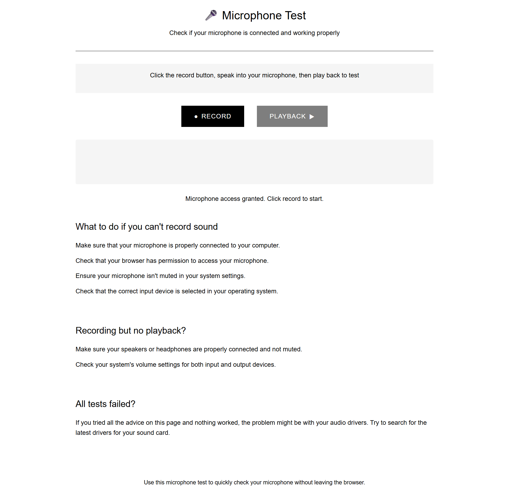

# Microphone Test Tool

A lightweight web application for testing your microphone directly in your browser.

```
+------------------------------------------------------------------------------+
|                                                                              |
|   __  __ _                      _                        _____         _     |
|  |  \/  (_) ___ _ __ ___  _ __ | |__   ___  _ __   ___  |_   _|__  ___| |_   |
|  | |\/| | |/ __| '__/ _ \| '_ \| '_ \ / _ \| '_ \ / _ \   | |/ _ \/ __| __|  |
|  | |  | | | (__| | | (_) | |_) | | | | (_) | | | |  __/   | |  __/\__ \ |_   |
|  |_|__|_|_|\___|_|_ \___/| .__/|_| |_|\___/|_| |_|\___|   |_|\___||___/\__|  |
|  |_   _|__   ___ | |     |_|                                                 |
|    | |/ _ \ / _ \| |                                                         |
|    | | (_) | (_) | |                                                         |
|    |_|\___/ \___/|_|                                                         |
|                                                              adnans.website  |
+------------------------------------------------------------------------------+
```

Preview:


---

## Features

* **One-Click Recording**: Easily check if your microphone is working
* **Permission Handling**: Prompts for microphone access directly in your browser
* **Playback Support**: Listen to your recording immediately after testing
* **Troubleshooting Guide**: Step-by-step help for common microphone issues

## How to Use

1. Open the `index.html` file in your web browser
2. Allow microphone access when prompted
3. Click **"Record"** to begin recording
4. Click **"Stop"** and play back your recording to verify sound input

## Technical Requirements

* Modern web browser with MediaDevices API support
* Microphone connected to your computer or device
* Speakers or headphones for playback

## Browser Compatibility

| Browser | Version |
| ------- | ------- |
| Chrome  | 47+     |
| Firefox | 29+     |
| Safari  | 11+     |
| Edge    | 79+     |

## Troubleshooting Common Issues

### What to do if you can't record sound

* Make sure that your microphone is properly connected to your computer.
* Check that your browser has permission to access your microphone.
* Ensure your microphone isn't muted in your system settings.
* Check that the correct input device is selected in your operating system.

### Recording but no playback?

* Make sure your speakers or headphones are properly connected and not muted.
* Check your system's volume settings for both input and output devices.

### All tests failed?

* If you tried all the advice on this page and nothing worked, the problem might be with your audio drivers.
* Try to search for the latest drivers for your sound card.

## Technical Details

This tool uses the **MediaDevices.getUserMedia API** to capture audio input and provides instant playback functionality using the Web Audio API.

## License

This project is provided as-is for personal and educational use.

## Contributing

To report issues or suggest improvements, please open an issue in the project repository.

> **Note**: Browsers may require user interaction before allowing microphone access. Be sure to grant permissions when prompted.
